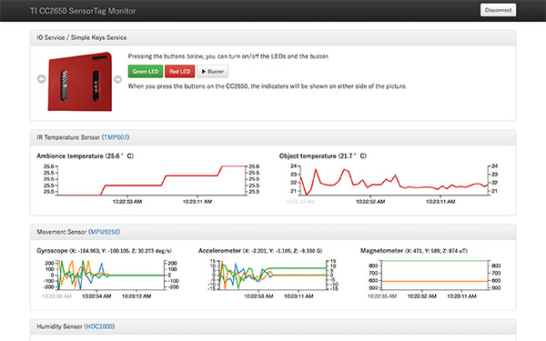

html5-CC2650SensorTag.js
===============

The html5-CC2650SensorTag.js is a JavaScript library which access [SimpleLink™ Bluetooth low energy/Multi-standard SensorTag (CC2650STK)](http://www.ti.com/tool/cc2650stk) using W3C [Web Bluetooth](https://webbluetoothcg.github.io/web-bluetooth/) API.

The html5-CC2650SensorTag.js allows you to get the measurement result reported by a CC2650 SensorTag in real time and to control the LEDs and the buzzer easily without learning the details of W3C Web Bluetooth specification and the BLE profile of the CC2650 SensorTag.

## Sample Application

This package includes a sample web application "[TI CC2650 SensorTag Monitor](https://rawgit.com/futomi/html5-CC2650SensorTag.js/master/sample/monitor/index.html)". You can try this JavaScript library without coding if you have a CC2650 SensorTag.



## Supported web browsers

The web browser has to support the W3C [Web Bluetooth](https://webbluetoothcg.github.io/web-bluetooth/) API:

* Chrome 56+ for Mac, Android M

Though Chrome OS supports the W3C [Web Bluetooth](https://webbluetoothcg.github.io/web-bluetooth/) API, I have not checked if this JavaScript library works well on Chrome OS. 

## Note

Never use the html5-CC2650SensorTag.js in your production for the reasons as follows:

* This JavaScript library is experimental. It is based on the W3C [Web Bluetooth](https://webbluetoothcg.github.io/web-bluetooth/) API which is been developing in W3C and it is unstable. In the future, the details of the specification may be changed and this JavaScript library may not work. 
* For now, only Chrome implements the W3C [Web Bluetooth](https://webbluetoothcg.github.io/web-bluetooth/) API. Besides, the implementation is experimental. If you try the API, you have to enable the API accessing `chrome://flags`.

This JavaScript library is affected by the several restrictions derived from the W3C [Web Bluetooth](https://webbluetoothcg.github.io/web-bluetooth/) API. It is strongly recommended to read the article &quot;[Interact with Bluetooth devices on the Web](https://developers.google.com/web/updates/2015/07/interact-with-ble-devices-on-the-web)&quot; published in the web site &quot;[Google Developers Web](https://developers.google.com/web/)&quot;.

---------------------------------------
## Table of Contents
* [Quick Start](#Quick-Start)
  * [Reading measurement results](#Quick-Start-1)
  * [Starting notifications](#Quick-Start-2)
  * [Enabling multiple sensors simultaneously](#Quick-Start-3)
  * [Changing the interval of notifications](#Quick-Start-4)
* [CC2650SensorTag object](#CC2650SensorTag-object)
  * [Methods](#CC2650SensorTag-methods)
    * [discover(*[namePrefix[, callback]]*)](#discover-method)
    * [connect(*[callback]*)](#connect-method)
    * [disconnect()](#disconnect-method)
    * [readDeviceInformation(*[callback]*)](#readDeviceInformation-method)
    * [readBatteryLevel(*[callback]*)](#readBatteryLevel-method)
    * [readConfigurations(*[callback]*)](#readConfigurations-method)
    * [writeConfigurations(*[config, callback]*)](#writeConfigurations-method)
    * [readPeriods(*[callback]*)](#readPeriods-method)
    * [writePeriods(*periods, [callback]*)](#writePeriods-method)
    * [readTemperature(*[callback]*)](#readTemperature-method)
    * [readMovement(*[callback]*)](#readMovement-method)
    * [readHumidity(*[callback]*)](#readHumidity-method)
    * [readPressure(*[callback]*)](#readPressure-method)
    * [readOptical(*[callback]*)](#readOptical-method)
    * [redLedOn(*[callback]*)](#redLedOn-method)
    * [redLedOff(*[callback]*)](#redLedOff-method)
    * [greenLedOn(*[callback]*)](#greenLedOn-method)
    * [greenLedOff(*[callback]*)](#greenLedOff-method)
    * [buzzerOn(*[callback]*)](#buzzerOn-method)
    * [buzzerOff(*[callback]*)](#buzzerOff-method)
    * [startBatteryNotifications(*[callback]*)](#startBatteryNotifications-method)
    * [stopBatteryNotifications(*[callback]*)](#stopBatteryNotifications-method)
    * [startTemperatureNotifications(*[callback]*)](#startTemperatureNotifications-method)
    * [stopTemperatureNotifications(*[callback]*)](#stopTemperatureNotifications-method)
    * [startMovementNotifications(*[callback]*)](#startMovementNotifications-method)
    * [stopMovementNotifications(*[callback]*)](#stopMovementNotifications-method)
    * [startHumidityNotifications(*[callback]*)](#startHumidityNotifications-method)
    * [stopHumidityNotifications(*[callback]*)](#stopHumidityNotifications-method)
    * [startPressureNotifications(*[callback]*)](#startPressureNotifications-method)
    * [stopPressureNotifications(*[callback]*)](#stopPressureNotifications-method)
    * [startOpticalNotifications(*[callback]*)](#startOpticalNotifications-method)
    * [stopOpticalNotifications(*[callback]*)](#stopOpticalNotifications-method)
    * [startKeysNotifications(*[callback]*)](#startKeysNotifications-method)
    * [stopKeysNotifications(*[callback]*)](#stopKeysNotifications-method)
  * [Properties](#CC2650SensorTag-properties)
    * [onbatterynotify](#onbatterynotify-property)
    * [ontemperaturenotify](#ontemperaturenotify-property)
    * [onmovementnotify](#onmovementnotify-property)
    * [onhumiditynotify](#onhumiditynotify-property)
    * [onhumiditynotify](#onhumiditynotify-property)
    * [onpressurenotify](#onpressurenotify-property)
    * [onopticalnotify](#onopticalnotify-property)
    * [onkeysnotify](#onkeysnotify-property)
    * [ondisconnect](#ondisconnect-property)
  * [CC2650SensorTagConfigurations object](#CC2650SensorTagConfigurations-object)
  * [CC2650SensorTagPeriods object](#CC2650SensorTagPeriods-object) 
* [References](#References)
* [License](#License)

---------------------------------------
## <a name="Quick-Start"> Quick Start</a>

This section shows how to use this JavaScript library. In this section, it is assumed that the HTML snippet below is written in your HTML:

```HTML
<button type="button" id="find-btn">Find your CC2650 SensorTag</button>
<script src="CC2650SensorTag.js"></script>
```

Put a `button` element for a trigger to find a CC2650 SensorTag and a `script` element loading the `CC2650SensorTag.js` in your HTML. 
That's it.

### <a name="Quick-Start-1">Reading measurement results</a>

The JavaScript code below shows how to get the temperature from the IR temperature sensor.

```JavaScript
document.getElementById('find-btn').addEventListener('click', () => {
  // Create a `CC2650SensorTag` object
  var tag = new CC2650SensorTag();
  // Find a CC2650 SensorTag
  // At this point, the Chrome shows a dialog which shows CC2650 SensorTags
  // and wait for the user selection.
  tag.discover().then(() => {
    // At this point, the user selected a CC2650 SensorTag listed the dialog.
    // Establish a connection with the CC2650 SensorTag the user selected
    return tag.connect();
  }).then(() => {
    // Enable the IR temperature sensor
    var c = {temperature: {enable_ir_temperature_sensor: true}};
    return tag.writeConfigurations(c);
  }).then(() => {
    // Read the measurement result of the IR temperature sensor
    return tag.readTemperature();
  }).then((data) => {
    // Show the ambient temperature
    console.log(data['ambience'] + '°C');
  }).catch((error) => {
    console.log(error.message);
  });
}, false);
```

Note that the CC2650 SensorTag disables all sensors by default. Therefore, you have to enable sensors you want to use calling `writeConfiguration()` method. In the sample code above, the IR temperature sensor was enabled.

### <a name="Quick-Start-2">Starting notifications</a>

The code below shows how to start the notifications of the IR temperature sensor and listen to the notifications.

```JavaScript
document.getElementById('find-btn').addEventListener('click', () => {
  var tag = new CC2650SensorTag();
  tag.discover().then(() => {
    return tag.connect();
  }).then(() => {
    var c = {temperature: {enable_ir_temperature_sensor: true}};
    return tag.writeConfigurations(c);
  }).then(() => {
    // Set an event handler for the notifications
    tag.ontemperaturenotify = function(data) {
      // Show the ambient temperature
      console.log(data['ambience'] + '°C');
    };
    // Start the notifications of the IR temperature sensor
    return tag.startTemperatureNotifications();
  }).catch((error) => {
    console.log(error.message);
  });
}, false);
```

### <a name="Quick-Start-3">Enabling multiple sensors simultaneously</a>

The code below shows how to enable multiple sensors simultaneously. In this case, the IR temperature sensor, the humidity sensor, and the barometric pressure sensor are enabled.

```JavaScript
document.getElementById('find-btn').addEventListener('click', () => {
  var tag = new CC2650SensorTag();
  tag.discover().then(() => {
    return tag.connect();
  }).then(() => {
    // Enable the IR temperature and humidity and barometric pressure sensors
    var c = {
      temperature: {enable_ir_temperature_sensor     : true},
      humidity   : {enable_humidity_sensor           : true},
      pressure   : {enable_barometric_pressure_sensor: true}
    };
    return tag.writeConfigurations(c);
  }).then(() => {
    // Set an event handler for the notifications from the IR temperature sensor
    tag.ontemperaturenotify = function(data) {
      // Show the ambient temperature
      console.log(data['ambience'] + '°C');
    };
    // Start the notifications of the IR temperature sensor
    return tag.startTemperatureNotifications();
  }).then(() => {
    // Set an event handler for the notifications from the humidity sensor
    tag.onhumiditynotify = function(data) {
      // Show the humidity
      console.dir(data['humidity'] + '%');
    };
    // Start the notifications of the humidity sensor
    return tag.startHumidityNotifications();
  }).then(() => {
    // Set an event handler for the notifications from the barometric pressure sensor
    tag.onpressurenotify = function(data) {
      // Show the barometric pressure
      console.dir(data['pressure'] + 'hPa');
    };
    // Start the notifications of the barometric pressure sensor
    return tag.startPressureNotifications();
  }).catch((error) => {
    console.log(error.message);
  });
}, false);
```

### <a name="Quick-Start-4">Changing the interval of notifications</a>

The CC2650 SensorTag notifies the measurement results per 1000 milliseconds (1 second) for each sensor by default. But the interval might be too long in some cases. If you want to change the interval, you can use the `writePeriods()` methods.

The code below shows how to change the notification interval for each sensor using the `writePeriods()` method.

```JavaScript
document.getElementById('find-btn').addEventListener('click', () => {
  var tag = new CC2650SensorTag();
  tag.discover().then(() => {
    return tag.connect();
  }).then(() => {
    // Enable the optical sensor and the accelerometer
    var c = {
      optical: {
        enable_optical_sensor: true
      },
      movement: {
        enable_accelerometer_x: true,
        enable_accelerometer_y: true,
        enable_accelerometer_z: true
      }
    };
    return tag.writeConfigurations(c);
  }).then(() => {
    // Change the intervals for the optical sensor and the gyroscope/accelerometer/magnetometer
    var periods = {
      optical    : 1500, // For the optical sensor
      movement   : 300, // For the accelerometer
    };
		return tag.writePeriods(periods);
  }).then(() => {
    // Set an event handler for the notifications from the optical sensor
    tag.onopticalnotify = function(data) {
      // Show the LUX
      console.log(data['light'] + 'lux');
    };
    // Start the notifications of the optical sensor
    return tag.startOpticalNotifications();
  }).then(() => {
    // Set an event handler for the notifications from the accelerometer
    tag.onmovementnotify = function(data) {
      // Show the results
      console.log('x:' + data['accx'] + 'G');
      console.log('y:' + data['accy'] + 'G');
      console.log('z:' + data['accz'] + 'G');
    };
    // Start the notifications of the the accelerometer
    return tag.startMovementNotifications();
  }).catch((error) => {
    console.log(error.message);
  });
}, false);
```

---------------------------------------
## <a name="CC2650SensorTag-object">CC2650SensorTag object</a>

In order to use the `CC2650SensorTag.js`, you have to create a `CC2650SensorTag` object from the `CC2650SensorTag` constructor as follows:

```JavaScript
var tag = new CC2650SensorTag();
```

In the code above, the variable `tag` represents a `CC2650SensorTag` object. All methods and properties are implemented in the `CC2650SensorTag` object.

Note that this code has to be executed after a user action such as a button click. This is due to the W3C Web Bluetooth API.

```html
<button type="button" id="find-btn">Find your CC2650 SensorTag</button>
```

```JavaScript
document.getElementById('find-btn').addEventListener('click', () => {
  var tag = new CC2650SensorTag();
  ...
}, false);
```

### <a name="CC2650SensorTag-methods">Methods</a>

This section describes the methods implemented in the [`CC2650SensorTag`](#Create-a-CC2650SensorTag-object) object.

Most of the methods implemented in the [`CC2650SensorTag`](#Create-a-CC2650SensorTag-object) object 
are asynchronous. They returns `Promise` object. But you can write codes in callback style as well. The two examples below do the same thing:

```JavaScript
tag.discover().then(() => {
  return tag.connect();
}).then(() => {
  var c = {temperature: {enable_ir_temperature_sensor: true}};
  return tag.writeConfigurations(c);
}).then(() => {
  return tag.readTemperature();
}).then((data) => {
  console.log(data['ambience'] + '°C');
});
```

```JavaScript
tag.discover(() => {
  tag.connect(() => {
    var c = {temperature: {enable_ir_temperature_sensor: true}};
    tag.writeConfigurations(c, () => {;
      tag.readTemperature((error, data) => {
        console.log(data['ambience'] + '°C');
      });
    });
  });
});
```

If you use the callback coding style, note that 2 arguments are passed to the callback function: the 1st argument is an `Error` object, the 2nd argument is an object representing the result of the method.

Note that such asynchronous methods don't return a `Promise` object if you pass a callback function to the method.

#### <a name="discover-method">discover(*[callback]*)</a>

This method starts to scan nearby CC2650 SensorTags. Calling this method, the Chrome shows a device chooser (dialog) to the user.

When the user chooses a device from the device chooser or cancels, a `Promise` object will be returned as long as the `callback` was not passed.

```JavaScript
tag.discover().then((info) => {
  // A device was chosen by the user
  console.log('"' + info['name'] + '" was chosen.');
}).catch((error) => {
  // Canceled or failed
  console.log('[ERROR] ' + error.message);
});
```

When a device was chosen, a hash object will be passed to the fulfillment handler, which includes a name and an identifier of the chosen device as follows:

Property | Type   | Description
:--------|:-------|:-----------
`id`     | String | The identifier of the device.
`name`   | String | The device name.

The `id` is a unique random string which the Chrome generates for each device. It is meaningless itself. It is just used to distinguish devices which have the same name.

If you want to use callback coding style instead of promise coding style, you can specify a callback function as the 1st argument.

```JavaScript
tag.discover((info) => {
  ...
});
```

#### <a name="connect-method">connect(*[callback]*)</a>

After a device was chosen successfully by the user through the `discover()` method, you can establish a connection with the device calling the `connect()` method.

```JavaScript
tag.discover().then(() => {
  return tag.connect();
}).then(() => {
  console.log('Connected.');
}).catch((error) => {
  console.log('[ERROR] ' + error.message);
});
```

#### <a name="disconnect-method">disconnect()</a>

This method disconnect the device. Note that this method is not asynchronous unlike the other methods. Therefore this method does not return anything.

```JavaScript
tag.disconnect();
```

Note that the `ondisconnect` event handler is **not** called when the device was disconnected due to this method. 

#### <a name="readDeviceInformation-method">readDeviceInformation(*[callback]*)</a>

This method starts to read the device information from the targeted device and returns a `Promise` object as long as the `callback` was not specified as an argument.

```JavaScript
tag.readDeviceInformation().then((info) => {
  console.log(info['model']); // e.g. 'CC2650 SensorTag'
});
```

A hash object is passed to the fulfillment handler, which has the properties as follows:

Property       | Type   | Description
:--------------|:-------|:-----------
`system`       | String | System ID
`model`        | String | Model Number
`firm`         | String | Firmware Revision
`hard`         | String | Hardware Revision
`soft`         | String | Software Revision
`manufacturer` | String | Manufacturer Name

Note that this method can be called without setting any configurations using [`writeConfigurations()`](writeConfigurations-method) method.

#### <a name="readBatteryLevel-method">readBatteryLevel(*[callback]*)</a>

This method starts to read the battery level from the targeted device and returns a `Promise` object as long as the `callback` was not specified as an argument.

```JavaScript
tag.readBatteryLevel().then((data) => {
  console.log(data['level'] + '%');
});
```

A hash object is passed to the fulfillment handler, which has the properties as follows:

Property       | Type   | Description
:--------------|:-------|:-----------
`level`        | Number | Battery level (percentage)

Note that this method can be called without setting any configurations using [`writeConfigurations()`](writeConfigurations-method) method.

#### <a name="readConfigurations-method">readConfigurations(*[callback]*)</a>

This method starts to read the configurations from the targeted device and returns a `Promise` object as long as the `callback` was not specified as an argument.

```JavaScript
tag.readConfigurations().then((config) => {
  console.dir(config);
});
```

A [`CC2650SensorTagConfigurations`](#CC2650SensorTagConfigurations-object) object is passed to the fulfillment handler.

Note that this method can be called without setting any configurations using [`writeConfigurations()`](writeConfigurations-method) method.


#### <a name="writeConfigurations-method">writeConfigurations(*config[, callback]*)</a>

This method starts to write the specified configurations to the targeted device and returns a `Promise` object as long as the `callback` was not specified as an argument.

A hash object must be passed to this method, which includes the configurations you want to set. The hash object is part of the [`CC2650SensorTagConfigurations`](#CC2650SensorTagConfigurations-object) object. When you create the hash object, the structure of the object must be as same as the [`CC2650SensorTagConfigurations`](#CC2650SensorTagConfigurations-object) object.

If the configuration were successfully written, a [`CC2650SensorTagConfigurations`](#CC2650SensorTagConfigurations-object) object representing the latest configurations will be passed to the fulfillment handler.

The code below shows how to enable the gyroscope and the barometric pressure sensor:

```JavaScript
var c = {
  movement: {
    enable_gyroscope_x: true,
    enable_gyroscope_y: true,
    enable_gyroscope_z: true
  },
  pressure: {
    enable_barometric_pressure_sensor: true
  }
};
tag.writeConfigurations(c).then((config) => {
  console.log('The configurations was successfully witten.');
  console.log('The current configurations are as follows:');
  console.log(JSON.stringify(config, null, '  '));
});
```

See the section &quot;[`CC2650SensorTagConfigurations`](#CC2650SensorTagConfigurations-object)&quot; for details.

#### <a name="readPeriods-method">readPeriods(*[callback]*)</a>

This method starts to read the period settings for notifications from the targeted device and returns a `Promise` object as long as the `callback` was not specified as an argument.

```JavaScript
tag.readPeriods().then((periods) => {
  console.log(JSON.stringify(periods, null, '  '));
});
```

A [`CC2650SensorTagPeriods`](#CC2650SensorTagPeriods-object) object is passed to the fulfillment handler.

Note that this method can be called without setting any configurations using [`writeConfigurations()`](writeConfigurations-method) method.

#### <a name="writePeriods-method">writePeriods(*periods, [callback]*)</a>

This method starts to write the specified period settings to the targeted device and returns a `Promise` object as long as the `callback` was not specified as an argument.

A hash object must be passed to this method, which includes the period settings you want to set. The hash object is part of the [`CC2650SensorTagPeriods`](#CC2650SensorTagPeriods-object) object. When you create the hash object, the structure of the object must be as same as the [`CC2650SensorTagPeriods`](#CC2650SensorTagPeriods-object) object.

If the period settings were successfully written, a [`CC2650SensorTagPeriods`](#CC2650SensorTagPeriods-object) object representing the latest period settings will be passed to the fulfillment handler.

The code below shows how to change the period settings for the IR temperature sensor and the gyroscope/accelerometer/magnetometer:

```JavaScript
var p = {
  temperature: 10000, // 10 seconds
  movement   : 300    // 300 milliseconds
};
tag.writePeriods(p).then((periods) => {
  console.log('The current period settings are as follows:');
  console.log(JSON.stringify(periods, null, '  '));
});
```

See the section &quot;[`CC2650SensorTagPeriods`](#CC2650SensorTagPeriods-object)&quot; for details.

#### <a name="readTemperature-method">readTemperature(*[callback]*)</a>

This method starts to read the measurement result of the IR temperature sensor ([TMP00](http://www.ti.com/product/tmp007)) from the targeted device and returns a `Promise` object as long as the `callback` was not specified as an argument.

Note that the configuration parameter `temperature.enable_ir_temperature_sensor` must be set to `true` before this method is called. See the section [`writeConfigurations()`](writeConfigurations-method) method for details.

```JavaScript
var c = {
  temperature: {
    enable_ir_temperature_sensor: true
  }
};
tag.writeConfigurations(c).then(() => {
  return tag.readTemperature();
}).then((data) => {
  console.log('* Ambient temperature: ' + data['ambience'] + '°C');
  console.log('* Object temperature : ' + data['object']   + '°C');
});
```

A hash object is passed to the fulfillment handler, which has the properties as follows:

Property   | Type   | Description
:----------|:-------|:-----------
`ambience` | Number | Die (ambience) temperature (°C)
`object`   | Number | Object temperature (°C)

#### <a name="readMovement-method">readMovement(*[callback]*)</a>

This method starts to read the measurement result of the movement sensor ([MPU9250](https://www.invensense.com/products/motion-tracking/9-axis/mpu-9250/)) from the targeted device and returns a `Promise` object as long as the `callback` was not specified as an argument.

Note that the configuration parameters related to the sensor must be set to `true` before this method is called. The configuration parameters related to this sensor are as follows:

```
movement.enable_gyroscope_x
movement.enable_gyroscope_y
movement.enable_gyroscope_z
movement.enable_accelerometer_x
movement.enable_accelerometer_y
movement.enable_accelerometer_z
movement.enable_magnetometer
```

See the section [`writeConfigurations()`](writeConfigurations-method) method for details.

```JavaScript
var c = {
  movement: {
    enable_gyroscope_x: true,
    enable_gyroscope_y: true,
    enable_gyroscope_z: true
  }
};
tag.writeConfigurations(c).then(() => {
  return tag.readMovement();
}).then((data) => {
  console.log('* Gyroscope:');
  console.log('  - X: ' + data['gyrx'] + ' deg/s');
  console.log('  - Y: ' + data['gyry'] + ' deg/s');
  console.log('  - Z: ' + data['gyrz'] + ' deg/s');
});
```

A hash object is passed to the fulfillment handler, which has the properties as follows:

Property | Type   | Description
:--------|:-------|:-----------
`gyrx`   | Number | This property represents the measurement result (X axis) of the gyroscope. The unit is deg/s. The value is in the range of -250 to +250.
`gyry`   | Number | This property represents the measurement result (Y axis) of the gyroscope. The unit is deg/s. The value is in the range of -250 to +250.
`gyrz`   | Number | This property represents the measurement result (Z axis) of the gyroscope. The unit is deg/s. The value is in the range of -250 to +250.
`accx`   | Number | This property represents the measurement result (X axis) of the accelerometer. The unit is G (Gravity). The range of the value depends on the configuration parameter [`movement.accelerometer_range`](#CC2650SensorTagConfigurations-object).
`accy`   | Number | This property represents the measurement result (Y axis) of the accelerometer. The unit is G (Gravity). The range of the value depends on the configuration parameter [`movement.accelerometer_range`](#CC2650SensorTagConfigurations-object).
`accz`   | Number | This property represents the measurement result (Z axis) of the accelerometer. The unit is G (Gravity). The range of the value depends on the configuration parameter [`movement.accelerometer_range`](#CC2650SensorTagConfigurations-object).
`magx`   | Number | This property represents the measurement result (X axis) of the magnetometer. The unit is uT (micro Tesla). The value is in the range of -4900 to +4900.
`magy`   | Number | This property represents the measurement result (Y axis) of the magnetometer. The unit is uT (micro Tesla). The value is in the range of -4900 to +4900.
`magz`   | Number | This property represents the measurement result (Z axis) of the magnetometer. The unit is uT (micro Tesla). The value is in the range of -4900 to +4900.

#### <a name="readHumidity-method">readHumidity(*[callback]*)</a>

This method starts to read the measurement result of the humidity sensor ([HDC1000](http://www.ti.com/product/hdc1000)) from the targeted device and returns a `Promise` object as long as the `callback` was not specified as an argument.

Note that the configuration parameter `humidity.enable_humidity_sensor` must be set to `true` before this method is called. See the section [`writeConfigurations()`](writeConfigurations-method) method for details.

```JavaScript
var c = {
  humidity: {
    enable_humidity_sensor: true
  }
};
tag.writeConfigurations(c).then(() => {
  return tag.readHumidity();
}).then((data) => {
  console.log('* Humidity    : ' + data['humidity']    + ' %');
  console.log('* Temperature : ' + data['temperature'] + ' °C');
});
```

A hash object is passed to the fulfillment handler, which has the properties as follows:

Property      | Type   | Description
:-------------|:-------|:-----------
`humidity`    | Number | Humidity (%)
`temperature` | Number | Temperature (°C)

#### <a name="readPressure-method">readPressure(*[callback]*)</a>

This method starts to read the measurement result of the barometric pressure sensor ([BMP280](https://www.bosch-sensortec.com/bst/products/all_products/bmp280)) from the targeted device and returns a `Promise` object as long as the `callback` was not specified as an argument.

Note that the configuration parameter `pressure.enable_barometric_pressure_sensor` must be set to `true` before this method is called. See the section [`writeConfigurations()`](writeConfigurations-method) method for details.

```JavaScript
var c = {
  pressure: {
    enable_barometric_pressure_sensor: true
  }
};
tag.writeConfigurations(c).then(() => {
  return tag.readPressure();
}).then((data) => {
  console.log('* Barometric Pressure : ' + data['pressure']    + ' hPa');
  console.log('* Temperature         : ' + data['temperature'] + ' °C');
});
```

A hash object is passed to the fulfillment handler, which has the properties as follows:

Property      | Type   | Description
:-------------|:-------|:-----------
`pressure`    | Number | Barometric pressure (hPa)
`temperature` | Number | Temperature (°C)

#### <a name="readOptical-method">readOptical(*[callback]*)</a>

This method starts to read the measurement result of the optical sensor ([OPT3001](http://www.ti.com/product/opt3001)) from the targeted device and returns a `Promise` object as long as the `callback` was not specified as an argument.

Note that the configuration parameter `optical.enable_optical_sensor` must be set to `true` before this method is called. See the section [`writeConfigurations()`](writeConfigurations-method) method for details.

```JavaScript
var c = {
  optical: {
    enable_optical_sensor: true
  }
};
tag.writeConfigurations(c).then(() => {
  return tag.readOptical();
}).then((data) => {
  console.log('* Luminance : ' + data['light'] + ' LUX');
});
```

A hash object is passed to the fulfillment handler, which has the properties as follows:

Property  | Type   | Description
:---------|:-------|:-----------
`light`   | Number | Luminance (LUX)

Note that the configuration parameter `optical.enable_optical_sensor` must be set to `true` before this method is called. See the section [`writeConfigurations()`](writeConfigurations-method) method for details.

#### <a name="redLedOn-method">redLedOn(*[callback]*)</a>

This method turns on the red LED and returns a `Promise` object as long as the `callback` was not specified as an argument.

```JavaScript
tag.redLedOn().then(() => {
  console.log('The red LED was turned on.');
});
```

#### <a name="redLedOff-method">redLedOff(*[callback]*)</a>

This method turns off the red LED and returns a `Promise` object as long as the `callback` was not specified as an argument.

```JavaScript
tag.redLedOff().then(() => {
  console.log('The red LED was turned off.');
});
```

#### <a name="greenLedOn-method">greenLedOn(*[callback]*)</a>

This method turns on the green LED and returns a `Promise` object as long as the `callback` was not specified as an argument.

```JavaScript
tag.greenLedOn().then(() => {
  console.log('The green LED was turned on.');
});
```

#### <a name="greenLedOff-method">greenLedOff(*[callback]*)</a>

This method turns off the green LED and returns a `Promise` object as long as the `callback` was not specified as an argument.

```JavaScript
tag.greenLedOff().then(() => {
  console.log('The green LED was turned off.');
});
```

#### <a name="buzzerOn-method">buzzerOn(*[callback]*)</a>

This method turns on the buzzer and returns a `Promise` object as long as the `callback` was not specified as an argument.

```JavaScript
tag.buzzerOn().then(() => {
  console.log('The buzzer was turned on.');
});
```

#### <a name="buzzerOff-method">buzzerOff(*[callback]*)</a>

This method turns off the buzzer and returns a `Promise` object as long as the `callback` was not specified as an argument.

```JavaScript
tag.buzzerOff().then(() => {
  console.log('The buzzer was turned off.');
});
```

#### <a name="startBatteryNotifications-method">startBatteryNotifications(*[callback]*)</a>

> *[CAUTION] The battery notifications does not work well for now. Though this method seems to be executed successfully, no notification is received. I don't know the reason.*

This method requests to start the notifications of the battery. In order to receive the notifications, you have to attach an event handler to the [`onbatterynotify`](#onbatterynotify-property) property in advance.

```JavaScript
tag.onbatterynotify = function(data) {
  console.log('* Battery level: ' + data['level'] + ' %');
};
tag.startBatteryNotifications().then(() => {
  console.log('Started the notifications of the battery.');
});
```

An hash object representing the measurement result is passed to the event handler as the 1st argument. The hash object is as same as the object obtained from the [`readBatteryLevel()`](#readBatteryLevel-method) method. See the section "[`readBatteryLevel()`](#readBatteryLevel-method)" for details.

#### <a name="stopBatteryNotifications-method">stopBatteryNotifications(*[callback]*)</a>

This method requests to stop the notifications of the battery.

```JavaScript
tag.stopBatteryNotifications().then(() => {
  console.log('Stopped the notifications of the battery.');
});
```

#### <a name="startTemperatureNotifications-method">startTemperatureNotifications(*[callback]*)</a>

This method requests to start the notifications of the IR temperature sensor. In order to receive the notifications, you have to attach an event handler to the [`ontemperaturenotify`](#ontemperaturenotify-property) property in advance.

Note that the configuration parameter `temperature.enable_ir_temperature_sensor` must be set to `true` before this method is called. See the section [`writeConfigurations()`](writeConfigurations-method) method for details.

```JavaScript
tag.ontemperaturenotify = function(data) {
  console.log('* Temperature: ' + data['ambience'] + ' °C');
};

var c = {
  temperature: {
    enable_ir_temperature_sensor: true
  }
};

tag.writeConfigurations(c).then(() => {
  return tag.startTemperatureNotifications();
}).then(() => {
  console.log('Started the notifications of the IR temperature sensor.');
});
```

An hash object representing the measurement result is passed to the event handler as the 1st argument. The hash object is as same as the object obtained from the [`readTemperature()`](#readTemperature-method) method. See the section "[`readTemperature()`](#readTemperature-method)" for details.

#### <a name="stopTemperatureNotifications-method">stopTemperatureNotifications(*[callback]*)</a>

This method requests to stop the notifications of the IR temperature sensor.

```JavaScript
tag.stopTemperatureNotifications().then(() => {
  console.log('Stopped the notifications of the IR temperature sensor.');
});
```

#### <a name="startMovementNotifications-method">startMovementNotifications(*[callback]*)</a>

This method requests to start the notifications of the movement sensor. In order to receive the notifications, you have to attach an event handler to the [`onmovementnotify`](#onmovementnotify-property) property in advance.

Note that the configuration parameters related to the sensor must be set to `true` before this method is called. The configuration parameters related to this sensor are as follows:

```
movement.enable_gyroscope_x
movement.enable_gyroscope_y
movement.enable_gyroscope_z
movement.enable_accelerometer_x
movement.enable_accelerometer_y
movement.enable_accelerometer_z
movement.enable_magnetometer
```

See the section [`writeConfigurations()`](writeConfigurations-method) method for details.

```JavaScript
tag.onmovementnotify = function(data) {
  console.log('* Gyroscope:');
  console.log('  - X: ' + data['gyrx'] + 'deg/s');
  console.log('  - Y: ' + data['gyry'] + 'deg/s');
  console.log('  - Z: ' + data['gyrz'] + 'deg/s');
};

var c = {
  movement: {
    enable_gyroscope_x: true,
    enable_gyroscope_y: true,
    enable_gyroscope_z: true
  }
};

tag.writeConfigurations(c).then(() => {
  return tag.startMovementNotifications();
}).then(() => {
  console.log('Started the notifications of the movement sensor.');
});
```

An hash object representing the measurement result is passed to the event handler as the 1st argument. The hash object is as same as the object obtained from the [`readMovement()`](#readMovement-method) method. See the section "[`readMovement()`](#readMovement-method)" for details.

#### <a name="stopMovementNotifications-method">stopMovementNotifications(*[callback]*)</a>

This method requests to stop the notifications of the movement sensor.

```JavaScript
tag.stopMovementNotifications().then(() => {
  console.log('Stopped the notifications of the movement sensor.');
});
```

#### <a name="startHumidityNotifications-method">startHumidityNotifications(*[callback]*)</a>

This method requests to start the notifications of the humidity sensor. In order to receive the notifications, you have to attach an event handler to the [`onhumiditynotify`](#onhumiditynotify-property) property in advance.

Note that the configuration parameter `humidity.enable_humidity_sensor` must be set to `true` before this method is called. See the section [`writeConfigurations()`](writeConfigurations-method) method for details.

```JavaScript
tag.onhumiditynotify = function(data) {
  console.log('* Humidity: ' + data['humidity'] + ' %');
};

var c = {
  humidity: {
    enable_humidity_sensor: true
  }
};

tag.writeConfigurations(c).then(() => {
  return tag.startHumidityNotifications();
}).then(() => {
  console.log('Started the notifications of the humidity sensor.');
});
```

An hash object representing the measurement result is passed to the event handler as the 1st argument. The hash object is as same as the object obtained from the [`readHumidity()`](#readHumidity-method) method. See the section "[`readHumidity()`](#readHumidity-method)" for details.

#### <a name="stopHumidityNotifications-method">stopHumidityNotifications(*[callback]*)</a>

This method requests to stop the notifications of the humidity sensor.

```JavaScript
tag.stopHumidityNotifications().then(() => {
  console.log('Stopped the notifications of the humidity sensor.');
});
```

#### <a name="startPressureNotifications-method">startPressureNotifications(*[callback]*)</a>

This method requests to start the notifications of the barometric pressure sensor. In order to receive the notifications, you have to attach an event handler to the [`onpressurenotify`](#onpressurenotify-property) property in advance.

Note that the configuration parameter `pressure.enable_barometric_pressure_sensor` must be set to `true` before this method is called. See the section [`writeConfigurations()`](writeConfigurations-method) method for details.

```JavaScript
tag.onpressurenotify = function(data) {
  console.log('* Barometric Pressure: ' + data['pressure'] + 'hPa');
};
tag.startPressureNotifications().then(() => {
  console.log('Started the notifications of the barometric pressure sensor.');
});
```

An hash object representing the measurement result is passed to the event handler as the 1st argument. The hash object is as same as the object obtained from the [`readPressure()`](#readPressure-method) method. See the section "[`readPressure()`](#readPressure-method)" for details.

#### <a name="stopPressureNotifications-method">stopPressureNotifications(*[callback]*)</a>

This method requests to stop the notifications of the barometric pressure sensor.

```JavaScript
tag.stopPressureNotifications().then(() => {
  console.log('Stopped the notifications of the barometric pressure sensor.');
});
```

#### <a name="startOpticalNotifications-method">startOpticalNotifications(*[callback]*)</a>

This method requests to start the notifications of the optical sensor. In order to receive the notifications, you have to attach an event handler to the [`onopticalnotify`](#onopticalnotify-property) property in advance.

Note that the configuration parameter `optical.enable_optical_sensor` must be set to `true` before this method is called. See the section [`writeConfigurations()`](writeConfigurations-method) method for details.

```JavaScript
tag.onopticalnotify = function(data) {
  console.log('* Luminance: ' + data['light'] + ' LUX');
};

var c = {
  optical: {
    enable_optical_sensor: true
  }
};

tag.writeConfigurations(c).then(() => {
  return tag.startOpticalNotifications();
}).then(() => {
  console.log('Started the notifications of the optical sensor.');
});
```

An hash object representing the measurement result is passed to the event handler as the 1st argument. The hash object is as same as the object obtained from the [`readOptical())`](#readOptical-method) method. See the section "[`readOptical()`](#readOptical-method)" for details.

#### <a name="stopOpticalNotifications-method">stopOpticalNotifications(*[callback]*)</a>

This method requests to stop the notifications of the optical sensor.

```JavaScript
tag.stopOpticalNotifications().then(() => {
  console.log('Stopped the notifications of the optical sensor.');
});
```

#### <a name="startKeysNotifications-method">startKeysNotifications(*[callback]*)</a>

This method requests to start the notifications of the Simple Keys Service. In order to receive the notifications, you have to attach an event handler to the [`onkeysnotify`](#onkeysnotify-property) property in advance.

```JavaScript
tag.onkeysnotify = function(data) {
  if(data['leftButton'] === true) {
    console.log('* The left button was pressed.');
  } else {
    console.log('* The left button was released.');
  }
  if(data['rightButton'] === true) {
    console.log('* The right button was pressed.');
  } else {
    console.log('* The right button was released.');
  }
};
tag.startKeysNotifications().then(() => {
  console.log('Started the notifications of the Simple Keys Service.');
});
```

An hash object representing the measurement result is passed to the event handler as the 1st argument, which has the properties as follows:

Property      | Type    | Description
:-------------|:--------|:-----------
`leftButton`  | Boolean | If the left button (user button) is pressed, the value is `true`, otherwise `false`.
`rightButton` | Boolean | If the right button (power button) is pressed, the value is `true`, otherwise `false`.
`reedRelay`   | Boolean | If the read relay is on, the value is `true`, otherwise `false`.


#### <a name="stopKeysNotifications-method">stopKeysNotifications(*[callback]*)</a>

This method requests to stop the notifications of the Simple Keys Service.

```JavaScript
tag.stopKeysNotifications().then(() => {
  console.log('Stopped the notifications of the Simple Keys Service.');
});
```

### <a name="CC2650SensorTag-properties">Properties</a>

#### <a name="onbatterynotify-property">onbatterynotify property</a>

This property is an event handler for the notifications of the battery. See the section "[`startBatteryNotifications()`](#startBatteryNotifications-method)" for details.

#### <a name="ontemperaturenotify-property">ontemperaturenotify property</a>

This property is an event handler for the notifications of the IR temperature sensor. See the section "[`startTemperatureNotifications()`](#startTemperatureNotifications-method)" for details.

#### <a name="onmovementnotify-property">onmovementnotify property</a>

This property is an event handler for the notifications of the movement sensor. See the section "[`startMovementNotifications()`](#startMovementNotifications-method)" for details.

#### <a name="onhumiditynotify-property">onhumiditynotify property</a>

This property is an event handler for the notifications of the humidity sensor. See the section "[`startHumidityNotifications()`](#startHumidityNotifications-method)" for details.

#### <a name="onpressurenotify-property">onpressurenotify property</a>

This property is an event handler for the notifications of the barometric pressure sensor. See the section "[`startPressureNotifications()`](#startPressureNotifications-method)" for details.

#### <a name="onopticalnotify-property">onopticalnotify property</a>

This property is an event handler for the notifications of the optical sensor. See the section "[`startOpticalNotifications()`](#startOpticalNotifications-method)" for details.

#### <a name="onkeysnotify-property">onkeysnotify property</a>

This property is an event handler for the notifications of the Simple Keys Service. See the section "[`startKeysNotifications()`](#startKeysNotifications-method)" for details.

#### <a name="ondisconnect-property">ondisconnect property</a>

This property is an event handler called when the connection was disconnected for any reasons except the disconnect due to the [`disconnect()`](#disconnect-method) method.

```JavaScript
tag.ondisconnect = function() {
  console.log('The device was disconnected.');
};
```

---------------------------------------
## <a name="CC2650SensorTagConfigurations-object"> CC2650SensorTagConfigurations object</a>

This object is just a hash object representing the configurations of the targeted device. You can obtain this object through the [`readConfigurations()`](#readConfigurations-method) method. You can also write the configurations using the structure of this object through the [`writeConfigurations()`](#writeConfigurations-method).

The structure of this object is follows:

Property                              | Type    | Description
:-------------------------------------|:------- |:-----------
`temperature`                         | Object  | This object represents the configurations of the IR temperature service (IR temperature sensor)
>> `enable_ir_temperature_sensor`      | Boolean | The value `ture` means the IR temperature sensor is enabled. The value `false` means it is disabled. The default value is `false`.
`movement`                            | Object  | This object represents the configurations of the movement service (gyroscope, accelerometer, magnetometer)
>> `enable_gyroscope_x`                | Boolean | The value `true` means the gyroscope (x axis) is enabled. The value `false` means it is disabled. The default value is `false`.
>> `enable_gyroscope_y`                | Boolean | The value `true` means the gyroscope (y axis) is enabled. The value `false` means it is disabled. The default value is `false`.
>> `enable_gyroscope_z`                | Boolean | The value `true` means the gyroscope (z axis) is enabled. The value `false` means it is disabled. The default value is `false`.
>> `enable_accelerometer_x`            | Boolean | The value `true` means the accelerometer (x axis) is enabled. The value `false` means it is disabled. The default value is `false`.
>> `enable_accelerometer_y`            | Boolean | The value `true` means the accelerometer (y axis) is enabled. The value `false` means it is disabled. The default value is `false`.
>> `enable_accelerometer_z`            | Boolean | The value `true` means the accelerometer (z axis) is enabled. The value `false` means it is disabled. The default value is `false`.
>> `enable_magnetometer`               | Boolean | The value `true` means the magnetometer is enabled. The value `false` means it is disabled. The default value is `false`.
>> `enable_wake_on_motion`             | Boolean | The value `true` means the Wake On Motion is enabled. The value `false` means it is disabled. The default value is `false`.
>> `accelerometer_range`               | Number  | The value must be an integer in the range of 0 to 3: 0 means 2G, 1 means 4G, and 3 means 16G.
`humidity`                            | Object  | This object represents the configurations of the humidity service (humidity sensor)
>> `enable_humidity_sensor`            | Boolean | The value `true` means the humidity sensor is enabled. The value `false` means it is disabled. The default value is `false`.
`pressure`                            | Object  | This object represents the configurations of the pressure service (barometric pressure sensor)
>> `enable_barometric_pressure_sensor` | Boolean | The value `true` means the barometric pressure sensor is enabled. The value `false` means it is disabled. The default value is `false`.
`optical`                             | Object  | This object represents the configurations of the optical service (optical sensor)
>> `enable_optical_sensor`             | Boolean | The value `true` means the optical sensor is enabled. The value `false` means it is disabled. The default value is `false`.
`io`                                  | Object  | This object represents the configurations of the IO service (2 buttons on the CC2650 SensorTag)
>> `mode`                              | Number  | This configuration represents the mode of the IO service: 0: local mode, 1: remote mode, 2: test mode. Though the default value of the CC2650 SensorTag is 0 (local mode), this Javascript library set it to 1 (remote mode) automatically. Never change this value using the [`writeConfigurations`](#writeConfigurations-method) method.

If you want to enable all of the sensors, you can use the [`writeConfigurations`](#writeConfigurations-method) method like this:

```JavaScript
var c = {
  temperature: {
    enable_ir_temperature_sensor: true
  },
  movement: {
    enable_gyroscope_x: true,
    enable_gyroscope_y: true,
    enable_gyroscope_z: true,
    enable_accelerometer_x: true,
    enable_accelerometer_y: true,
    enable_accelerometer_z: true,
    enable_magnetometer: true
  },
  humidity: {
    enable_humidity_sensor: true
  },
  pressure: {
    enable_barometric_pressure_sensor: true
  },
  optical: {
    enable_optical_sensor: true
  }
};
tag.writeConfigurations(c).then((conf) => {
  console.log('The current configurations are as follows:');
  console.log(JSON.stringify(conf, null, '  '));
});
```

## <a name="CC2650SensorTagPeriods-object"> CC2650SensorTagPeriods object</a>

This object is just a hash object representing the period settings for notifications of the targeted device. You can obtain this object through the [`readPeriods()`](#readPeriods-method) method. You can also write the period settings using the structure of this object through the [`writePeriods()`](#writePeriods-method).

The structure of this object is follows:

Property      | Type   | Description
:-------------|:------ |:-----------
`temperature` | Number | This property represents the notification period of the IR temperature sensor. The value must be in the range of 300 to 2550 (milliseconds). The default value is 1000.
`movement`    | Number | This property represents the notification period of the gyroscope/accelerometer/magnetometer. The value must be in the range of 100 to 2550 (milliseconds). The default value is 1000.
`humidity`    | Number | This property represents the notification period of the humidity sensor. The value must be in the range of 100 to 2550 (milliseconds). The default value is 1000.
`pressure`    | Number | This property represents the notification period of the barometric pressure sensor. The value must be in the range of 100 to 2550 (milliseconds). The default value is 1000.
`optical`     | Number | This property represents the notification period of the optical sensor. The value must be in the range of 100 to 2550 (milliseconds). The default value is 800.


If you want to change the period settings for some sensors, you can use the [`writePeriods`](#writePeriods-method) method like this:

```JavaScript
var p = {
  temperature: 10000, // 10 seconds
  movement   : 300,   // 300 milliseconds
};
tag.writePeriods(p).then((periods) => {
  console.log('The current period settings are as follows:');
  console.log(JSON.stringify(periods, null, '  '));
});
```

---------------------------------------
## <a name="References"> References</a>

* [Texas Instruments - CC2650 SensorTag User's Guide](http://processors.wiki.ti.com/index.php/CC2650_SensorTag_User%27s_Guide)
* [W3C - Web Bluetooth](https://webbluetoothcg.github.io/web-bluetooth/)
* [Google Developers - Interact with Bluetooth devices on the Web](https://developers.google.com/web/updates/2015/07/interact-with-ble-devices-on-the-web)
* [Web Blutooth Samples](https://googlechrome.github.io/samples/web-bluetooth/)

---------------------------------------
## <a name="License"> License</a>

The MIT License (MIT)

Copyright 2016 Futomi Hatano

Permission is hereby granted, free of charge, to any person obtaining a copy
of this software and associated documentation files (the "Software"), to
deal in the Software without restriction, including without limitation the
rights to use, copy, modify, merge, publish, distribute, sublicense, and/or
sell copies of the Software, and to permit persons to whom the Software is
furnished to do so, subject to the following conditions:

The above copyright notice and this permission notice shall be included in
all copies or substantial portions of the Software.

THE SOFTWARE IS PROVIDED "AS IS", WITHOUT WARRANTY OF ANY KIND, EXPRESS OR
IMPLIED, INCLUDING BUT NOT LIMITED TO THE WARRANTIES OF MERCHANTABILITY,
FITNESS FOR A PARTICULAR PURPOSE AND NONINFRINGEMENT. IN NO EVENT SHALL THE
AUTHORS OR COPYRIGHT HOLDERS BE LIABLE FOR ANY CLAIM, DAMAGES OR OTHER
LIABILITY, WHETHER IN AN ACTION OF CONTRACT, TORT OR OTHERWISE, ARISING
FROM, OUT OF OR IN CONNECTION WITH THE SOFTWARE OR THE USE OR OTHER DEALINGS
IN THE SOFTWARE.
